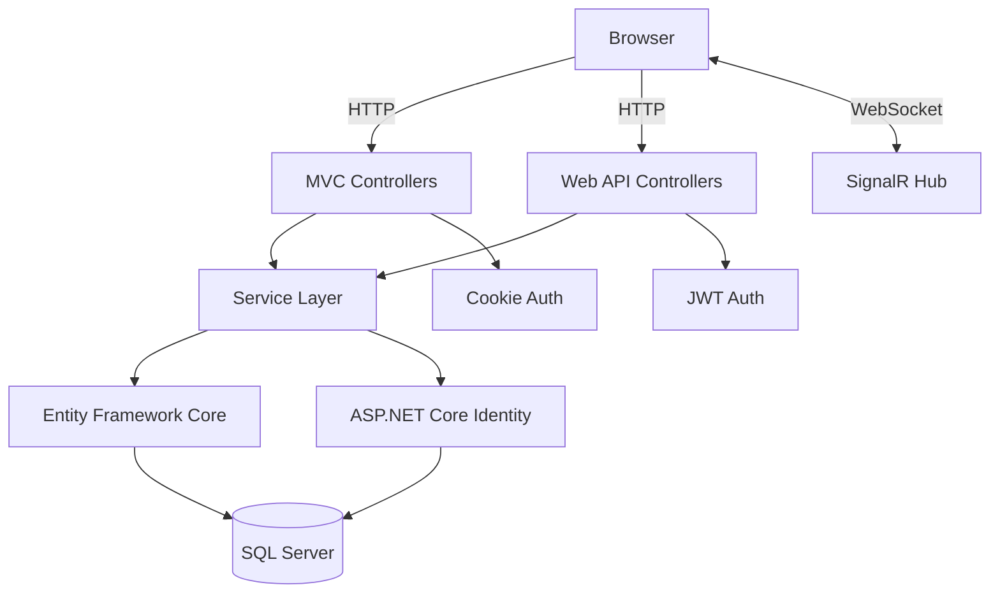

# ARCHITECTURE.md — System Architecture

## Overview

EventSphere is a **monolithic ASP.NET Core 8 full-stack application** with MVC for server-rendered frontend and Web API for client/consumer endpoints.

## Architecture Style

**Layered Monolith** with clear separation:

```
Presentation Layer
├── ASP.NET Core MVC (Razor Views) — browser frontend
└── ASP.NET Core Web API — API consumers

Application Layer
└── Service classes (business logic)

Data Access Layer
├── Entity Framework Core (DbContext)
└── SQL Server
```

## System Diagram



## Major Components

### Presentation Layer
- **MVC Controllers** — serve Razor Views for browser clients
- **API Controllers** — serve JSON for API consumers
- **Razor Views** — server-rendered HTML
- **ViewModels** — shaped data for views
- **DTOs** — data transfer objects for API

### Application Layer
- **Service Classes** — business logic, orchestration
- **Interfaces** — contracts for DI

### Data Access Layer
- **ApplicationDbContext** — EF Core context
- **Entities** — domain models mapped to database tables
- **Migrations** — database schema versioning

### Cross-Cutting
- **ASP.NET Core Identity** — authentication, authorization
- **SignalR** — real-time notifications
- **Logging** — via ASP.NET Core logging

## Request Lifecycles

### MVC Request (Browser)
```
Browser → HTTP Request → Routing → MVC Controller
→ Service (business logic) → EF Core → SQL Server
→ Service returns data → ViewModel created
→ Razor View renders HTML → HTTP Response
```

### API Request (Client)
```
Client → HTTP Request → Routing → API Controller
→ Model Validation → Service (business logic)
→ EF Core → SQL Server → Service returns DTO
→ JSON Response with HTTP Status Code
```

### SignalR Connection
```
Browser → WebSocket → SignalR Hub
→ Hub methods → Application Services
→ Data Layer → Push updates to clients
```

## Project Structure

```
EventSphere/
├── EventSphere.Web/           # Single ASP.NET Core project
│   ├── Controllers/           # MVC + API controllers
│   │   └── Api/              # Web API controllers
│   ├── Services/              # Business logic
│   │   ├── Interfaces/
│   │   └── Implementations/
│   ├── Data/                  # DbContext, Migrations
│   ├── Models/Entities/       # Domain models
│   ├── ViewModels/            # View models for Razor
│   ├── Views/                 # Razor Views
│   │   ├── Shared/
│   │   ├── Home/
│   │   ├── Events/
│   │   ├── Account/
│   │   └── ...
│   ├── Hubs/                  # SignalR hubs
│   ├── wwwroot/               # Static files (CSS, JS, images)
│   ├── Program.cs
│   └── appsettings.json
├── EventSphere.Tests/         # Tests
├── EventSphere.sln
└── .agent/
```

## Dependencies

```
EventSphere.Web
├── Microsoft.AspNetCore.Identity.EntityFrameworkCore
├── Microsoft.EntityFrameworkCore.SqlServer
├── Microsoft.EntityFrameworkCore.Tools
├── Microsoft.AspNetCore.Authentication.JwtBearer
└── Microsoft.AspNetCore.SignalR

EventSphere.Tests
├── Microsoft.NET.Test.Sdk
├── xunit
├── xunit.runner.visualstudio
├── Moq
└── Microsoft.EntityFrameworkCore.InMemory
```

## Team Module Ownership

See `.agent/PHASES.md` for full team structure and phase breakdown.

| Module | Owner | Scope |
|---|---|---|
| Module 1 | Abdullah | Backend Core & Architecture |
| Module 2 | Jibran | Database + Data-Heavy Backend |
| Module 3 | Ramsha | Frontend Core + Shared UI |
| Module 4 | Marukh | Frontend Features + Dashboards |

## Architectural Constraints

- SQL Server is the only supported database.
- Entity Framework Core is the only ORM.
- ASP.NET Core Identity is the only user management system.
- No separate SPA frontend — MVC + Razor is the frontend.
- SignalR only for genuine real-time features.

## Known Risks

- No health check endpoints (P1 gap).
- No request rate limiting (P2 gap).
- No structured logging provider (P2 gap).
- No API versioning (P2 gap).
- Payment processing out of scope per SRS.
