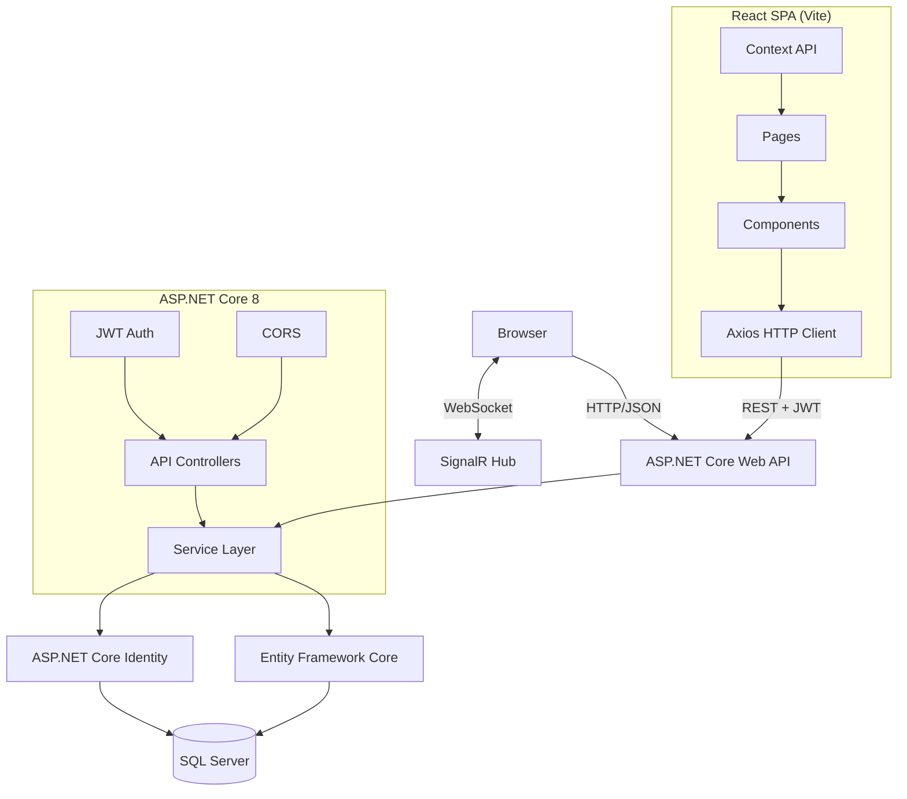

# ARCHITECTURE.md — System Architecture

## Overview

EventSphere is a **decoupled full-stack application** with a React SPA frontend and ASP.NET Core Web API backend, communicating over HTTP/JSON.

## Architecture Style

**Client-Server Architecture** with clear separation:

```
React SPA (Frontend)          ASP.NET Core Web API (Backend)
├── React 18+                 ├── Controllers (API only)
├── React Router              ├── Services (Business Logic)
├── Axios                     ├── Entity Framework Core
├── Bootstrap                 ├── ASP.NET Core Identity
└── Vite                      └── SQL Server
```

## System Diagram



## Request Lifecycles

### SPA Page Load
```
Browser → Vite Dev Server / Static Files
→ React App Loads → React Router resolves route
→ Component mounts → Axios GET /api/...
→ API Controller → Service → EF Core → SQL
→ JSON Response → React state update → UI renders
```

### Authenticated Request
```
React Component → Axios with Authorization header
→ API Controller [Authorize] → JWT validation
→ Service → EF Core → SQL → JSON Response
```

### Real-Time (SignalR)
```
React App → SignalR JS Client → WebSocket
→ NotificationHub → Service → Database
→ Push update to connected clients
```

## Project Structure

```
EventSphere/
├── EventSphere.Api/              # ASP.NET Core Web API
│   ├── Controllers/              # API Controllers
│   ├── Services/                 # Business logic
│   ├── Data/                     # DbContext, Migrations
│   ├── Models/Entities/          # Domain models
│   ├── DTOs/                     # Data transfer objects
│   ├── Hubs/                     # SignalR hubs
│   ├── Program.cs
│   └── appsettings.json
├── EventSphere.React/            # React SPA (Vite)
│   ├── src/
│   │   ├── components/           # Reusable UI components
│   │   ├── pages/                # Route-level pages
│   │   ├── services/             # API call functions
│   │   ├── context/              # React Context (auth, etc.)
│   │   ├── hooks/                # Custom hooks
│   │   ├── types/                # TypeScript interfaces
│   │   ├── App.tsx               # Router setup
│   │   └── main.tsx              # Entry point
│   ├── public/
│   ├── package.json
│   ├── vite.config.ts
│   └── tsconfig.json
├── EventSphere.Tests/            # Unit & Integration tests
├── EventSphere.sln
└── .agent/                       # This documentation
```

## Dependencies

### Backend (ASP.NET Core Web API)
```
Microsoft.AspNetCore.Identity.EntityFrameworkCore
Microsoft.EntityFrameworkCore.SqlServer
Microsoft.EntityFrameworkCore.Tools
Microsoft.AspNetCore.Authentication.JwtBearer
Microsoft.AspNetCore.SignalR
Microsoft.AspNetCore.Cors
```

### Frontend (React)
```
react, react-dom, react-router-dom
axios
bootstrap, react-bootstrap
@microsoft/signalr
typescript
vite
```

### Tests
```
Microsoft.NET.Test.Sdk, xunit, xunit.runner.visualstudio
Moq, Microsoft.EntityFrameworkCore.InMemory
@testing-library/react, vitest (or jest)
```

## Architectural Constraints

- SQL Server is the only supported database.
- Entity Framework Core is the only ORM.
- ASP.NET Core Identity for user management.
- JWT Bearer for API authentication.
- React is the frontend (no Razor Views).
- CORS must be configured for React dev server.

## Known Risks

- No health check endpoints (P1 gap).
- No request rate limiting (P2 gap).
- No API versioning (P2 gap).
- Payment processing out of scope per SRS.
- CORS misconfiguration risk in production.
