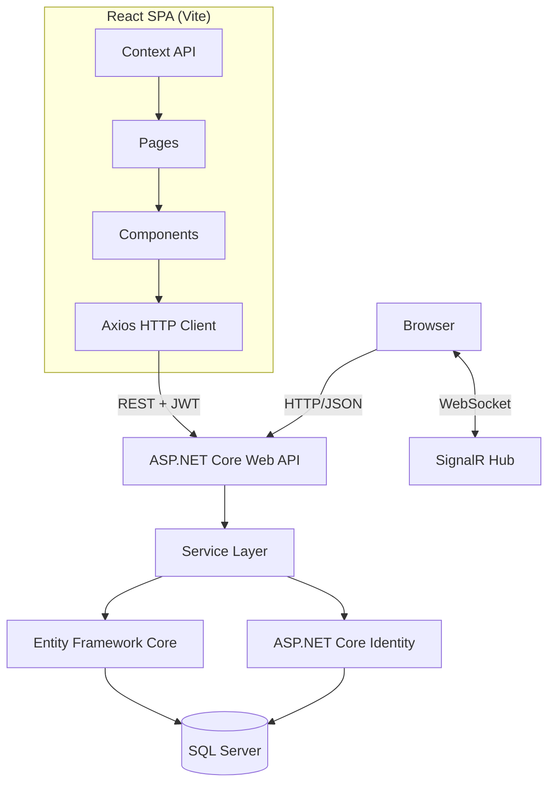

# ARCHITECTURE.md — System Architecture

## Overview

EventSphere is a **decoupled full-stack application** with a React SPA frontend and ASP.NET Core Web API backend.

## Architecture Style

**Client-Server Architecture**:

```
React SPA (Frontend)          ASP.NET Core Web API (Backend)
├── React 18+                 ├── API Controllers
├── React Router              ├── Services (Business Logic)
├── Axios                     ├── Entity Framework Core
├── Bootstrap                 ├── ASP.NET Core Identity
└── Vite                      └── SQL Server
```

## System Diagram



## Project Structure

```
EventSphere/
├── EventSphere.Api/              # ASP.NET Core Web API
│   ├── Controllers/
│   ├── Services/
│   ├── Data/
│   ├── Models/Entities/
│   ├── DTOs/
│   ├── Hubs/
│   ├── Program.cs
│   └── appsettings.json
├── EventSphere.React/            # React SPA (Vite)
│   ├── src/
│   │   ├── components/
│   │   ├── pages/
│   │   ├── services/
│   │   ├── context/
│   │   ├── hooks/
│   │   ├── types/
│   │   ├── App.tsx
│   │   └── main.tsx
│   ├── package.json
│   └── vite.config.ts
├── EventSphere.Tests/
├── EventSphere.sln
└── .agent/
```

## Request Lifecycles

### SPA Page Load
```
Browser → Vite Dev Server → React App
→ React Router → Component mounts
→ Axios GET /api/... → API Controller
→ Service → EF Core → SQL
→ JSON Response → React state → UI renders
```

### Authenticated Request
```
React → Axios with Authorization header
→ API Controller [Authorize] → JWT validation
→ Service → EF Core → SQL → JSON Response
```

## Team Module Ownership

See `.agent/PHASES.md` for full team structure and phase breakdown.

| Module | Owner | Scope |
|---|---|---|
| Module 1 | Abdullah | Backend Core & Architecture |
| Module 2 | Jibran | Database + Data-Heavy Backend |
| Module 3 | Ramsha | Frontend Core + Shared UI |
| Module 4 | Marukh | Frontend Features + Dashboards |

## Dependencies

### Backend
```
Microsoft.AspNetCore.Identity.EntityFrameworkCore
Microsoft.EntityFrameworkCore.SqlServer
Microsoft.AspNetCore.Authentication.JwtBearer
Microsoft.AspNetCore.SignalR
Microsoft.AspNetCore.Cors
```

### Frontend
```
react, react-dom, react-router-dom
axios, bootstrap, react-bootstrap
@microsoft/signalr, typescript, vite
```

## Known Risks

- No health check endpoints (P1 gap).
- No request rate limiting (P2 gap).
- Payment processing out of scope per SRS.
