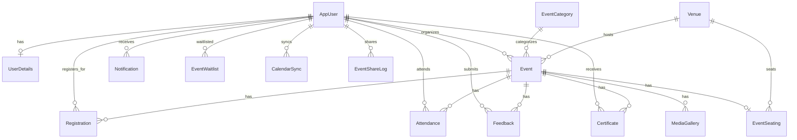

# DATABASE.md — SQL Server + Entity Framework Core

## Stack

- **Database**: Microsoft SQL Server
- **ORM**: Entity Framework Core 8
- **Identity**: ASP.NET Core Identity (EF Core stores)

## DbContext

`ApplicationDbContext` inherits `IdentityDbContext<AppUser>`.

```
DbSets:
├── Users (Identity)
├── UserDetails
├── Events
├── EventCategories
├── Registrations
├── Attendance
├── Feedback
├── Certificates
├── MediaGallery
├── Venues
├── EventSeating
├── EventWaitlist
├── CalendarSync
├── EventShareLog
├── Notifications
└── (Identity tables: Roles, Claims, etc.)
```

## Entities (from SRS)

### AppUser (extends IdentityUser)
- `FirstName`, `LastName`, `Bio`, `ProfileImageUrl`
- `CreatedAt`, `IsActive`
- Navigation: UserDetails, OrganizedEvents, Registrations, Attendance, Feedback, Certificates, Notifications

### UserDetails
- `Id`, `FullName`, `Mobile`, `Department`, `EnrollmentNo`
- FK: `UserId` → AppUser

### Event
- `Id`, `Title`, `Description`
- `Category` (technical, cultural, sports, etc.)
- `Date`, `Time`, `Venue`
- `MaxParticipants`, `ImageUrl`
- `Status` (PendingApproval, Approved, Rejected, Cancelled)
- `CreatedAt`, `UpdatedAt`
- FK: `OrganizerId` → AppUser

### EventCategory
- `Id`, `Name`, `Description`, `IconCssClass`
- Unique index on Name

### Registration
- `Id`, `RegisteredOn`, `Status` (confirmed, cancelled, waitlist)
- FK: `StudentId` → AppUser, `EventId` → Event
- Unique composite index: (StudentId, EventId)

### Attendance
- `Id`, `Attended` (bool), `MarkedOn`, `QrCode`
- FK: `StudentId` → AppUser, `EventId` → Event

### Feedback
- `Id`, `Rating` (1-5), `Comments`, `SubmittedOn`
- FK: `StudentId` → AppUser, `EventId` → Event
- Unique composite index: (StudentId, EventId)

### Certificate
- `Id`, `CertificateUrl`, `IssuedOn`, `FeePaid`
- FK: `StudentId` → AppUser, `EventId` → Event

### MediaGallery
- `Id`, `FileType` (image, video), `FileUrl`, `Caption`, `UploadedOn`
- FK: `EventId` → Event, `UploadedBy` → AppUser

### Venue
- `Id`, `Name`, `Address`, `City`, `State`, `ZipCode`
- `Capacity`, `ContactEmail`, `ContactPhone`

### EventSeating
- `Id`, `TotalSeats`, `SeatsBooked`, `WaitlistEnabled`
- FK: `EventId` → Event, `VenueId` → Venue
- `SeatsAvailable` = derived (TotalSeats - SeatsBooked)

### EventWaitlist
- `Id`, `WaitlistTime`, `Status` (waiting, confirmed, cancelled)
- FK: `UserId` → AppUser, `EventId` → Event

### CalendarSync
- `Id`, `CalendarType` (Google, Outlook, Apple), `SyncTimestamp`, `CalendarUrl`
- FK: `UserId` → AppUser, `EventId` → Event

### EventShareLog
- `Id`, `Platform` (Facebook, WhatsApp, Twitter, etc.), `ShareTimestamp`, `ShareMessage`
- FK: `UserId` → AppUser, `EventId` → Event

### Notification
- `Id`, `Title`, `Message`, `IsRead`, `Link`, `CreatedAt`
- FK: `UserId` → AppUser
- Index: (UserId, IsRead)

## Relationships



## Seed Data

- 8 categories: Technical, Cultural, Sports, Workshop, Seminar, Competition, Annual Day, Social
- Admin user: `admin@eventsphere.com` / `Admin@123`
- Organizer user: `organizer@eventsphere.com` / `Organizer@123`
- Sample events

## Migrations

```bash
dotnet ef migrations add <Name> --project EventSphere.Web
dotnet ef database update --project EventSphere.Web
dotnet ef migrations remove --project EventSphere.Web
```

## Rules

- Always create migrations for schema changes.
- Review generated migration code before committing.
- Use `DateTime.UtcNow` for all timestamps.
- Unique indexes on: EventCategory.Name, Registration(StudentId,EventId), Feedback(StudentId,EventId).
- `SeatsAvailable` is derived, never stored.
- Waitlist auto-adjustment on cancellation.
