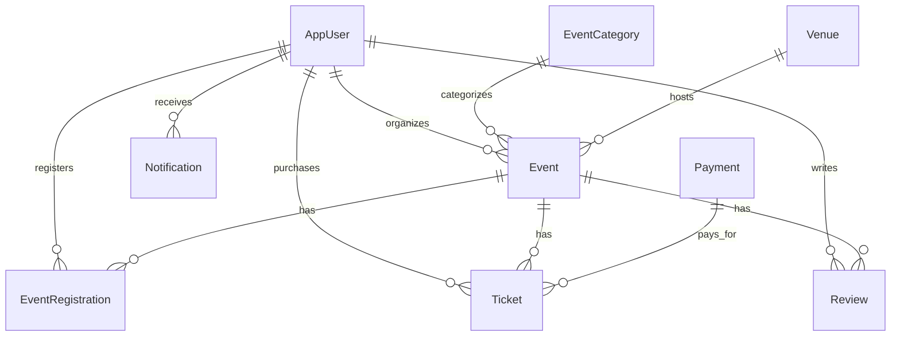

# DATABASE.md — SQL Server + Entity Framework Core

## Stack

- **Database**: Microsoft SQL Server
- **ORM**: Entity Framework Core 8
- **Identity**: ASP.NET Core Identity (EF Core stores)

## DbContext

`ApplicationDbContext` inherits `IdentityDbContext<AppUser>`.

```
DbSets:
├── Events
├── EventCategories
├── EventRegistrations
├── Tickets
├── Payments
├── Venues
├── Reviews
├── Notifications
└── (Identity tables: Users, Roles, Claims, etc.)
```

## Entities

### AppUser (extends IdentityUser)
- `FirstName`, `LastName`, `Bio`, `ProfileImageUrl`
- `CreatedAt`, `IsActive`
- Navigation: OrganizedEvents, Registrations, Tickets, Reviews, Notifications

### Event
- `Id`, `Title`, `Description`
- `StartDate`, `EndDate`
- `Location`, `ImageUrl`
- `MaxAttendees`, `TicketPrice`, `IsFree`
- `IsPublished`, `IsCancelled`
- `CreatedAt`, `UpdatedAt`
- FK: `OrganizerId` → AppUser, `CategoryId` → EventCategory, `VenueId` → Venue

### EventCategory
- `Id`, `Name`, `Description`, `IconCssClass`
- Unique index on Name

### EventRegistration
- `Id`, `RegisteredAt`, `IsCancelled`
- FK: `UserId` → AppUser, `EventId` → Event
- Unique composite index: (UserId, EventId)

### Ticket
- `Id`, `TicketCode` (unique), `TicketType`
- `PurchasedAt`, `IsUsed`, `UsedAt`, `Price`
- FK: `UserId` → AppUser, `EventId` → Event, `PaymentId` → Payment

### Payment
- `Id`, `Amount`, `Currency`, `Status`
- `PaymentMethod`, `TransactionId`
- `CreatedAt`, `CompletedAt`
- FK: `UserId` → AppUser, `EventId` → Event

### Venue
- `Id`, `Name`, `Address`, `City`, `State`, `ZipCode`
- `Capacity`, `ContactEmail`, `ContactPhone`

### Review
- `Id`, `Rating` (1-5), `Comment`, `CreatedAt`
- FK: `UserId` → AppUser, `EventId` → Event
- Unique composite index: (UserId, EventId)

### Notification
- `Id`, `Title`, `Message`, `IsRead`, `Link`, `CreatedAt`
- FK: `UserId` → AppUser
- Index: (UserId, IsRead)

## Relationships



## Seed Data

- 8 categories: Music, Technology, Sports, Food & Drink, Arts & Culture, Business, Education, Community.
- Admin user: `admin@eventsphere.com` / `Admin@123`
- Organizer user: `organizer@eventsphere.com` / `Organizer@123`
- Sample events (Tech Conference, Music Festival, Food Expo).

## Migrations

```bash
# Add migration
dotnet ef migrations add <MigrationName> --project EventSphere.Web

# Update database
dotnet ef database update --project EventSphere.Web

# Remove last migration
dotnet ef migrations remove --project EventSphere.Web
```

## Rules

- Always create migrations for schema changes.
- Review generated migration code before committing.
- Never delete migration files without replacement.
- Use `decimal(18,2)` for monetary values.
- Use `DateTime.UtcNow` for all timestamps.
- Unique indexes on: EventCategory.Name, Ticket.TicketCode, EventRegistration(UserId,EventId), Review(UserId,EventId).
